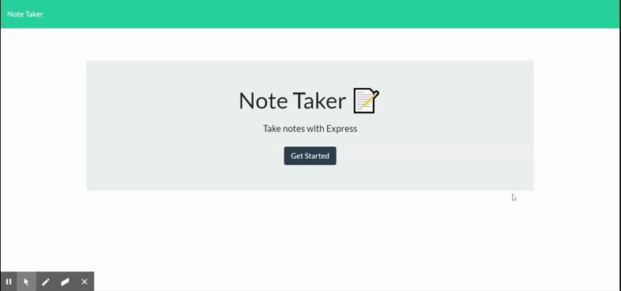

# Note Taker


## Description
Note Taker is an app for users to keep their notes. Users can write new notes, read existing notes, and deletes notes once they no longer wish to keep them.

## Table of Contents
* [Background](#background)
* [Approach](#approach)
* [Tools](#tools)
* [Site](#site)
* [License](#license)
* [Contributing](#contributing)
* [Questions](#questions)
* [Authors](#authors)

## Background
The objective of this exercise was to build an express backend as part of an application that writes, saves, and deletes notes using a JSON file.

Acceptance criteria is as follows:

```
Application should allow users to create and save notes.

Application should allow users to view previously saved notes.

Application should allow users to delete previously saved notes.
```

## Site Pictures


## Approach

There were several areas to focus on in this project:
1) Creating a GET route that reads the JSON file and returns all saved notes as JSON
2) Creating a POST route that receives a new note, saves it to the JSON file, then returns the new note
3) Creating a DELETE route that receives a query parameter containing the id of a note to delete, deleting that note, then rewriting and returning the JSON file

### Creating a GET route
The below route listens for a GET request to "/api/note", reads from the db.json file, and then returns data. In order for the data to display correctly once returned to the client side, the data must undergo JSON.parse prior to being returned.

```
app.get("/api/notes", function (req, res) {
    fs.readFile("db/db.json", function (error, data) {
        let sendData = JSON.parse(data);
        res.json(sendData);
    })
})
```
### Creating a POST route
The POST request saves the note to the request body where the value of "0" is added as an id and pushed into a new array. Previous notes are then read from the db.json file and assigned new id's, beginning with a value of "1" and increasing with each subsequent index. The id values are converted to strings and then each note is pushed into the new array. The new array is then written to the db.json and returned to the client.

```
app.post("/api/notes", function (req, res) {
    const newArray = [];
    let newNote = req.body;
    console.log(newNote);
    newNote.id = "0";
    newArray.push(newNote);
    fs.readFile("db/db.json", function (error, data) {
        let temp = JSON.parse(data);
        for (let i = 0; i < temp.length; i++) {
            let num = (i + 1)
            temp[i].id = num.toString();
            newArray.push(temp[i])
        }
        console.log(newArray);
        fs.writeFile("db/db.json", JSON.stringify(newArray), function (error, data) {
            if (error) throw error;
            console.log("Check the file")
        })

        res.json(newArray)

    })


    console.log(newArray)

})
```
### Creating a DELETE route
The DELETE route receives the id of the note to be deleted. The existing notes are read from the db.json file and added into a new array. Using the id, the note to be deleted is identified and removed from the array using splice. Finally, the new array is written to the db.json file and returned to the client. 

```
app.delete("/api/notes/:id", function (req, res) {
    let chosen = req.params.id;

    const newArray = [];

    console.log(chosen);
    fs.readFile("db/db.json", function (error, data) {
        let temp = JSON.parse(data);
        for (let i = 0; i < temp.length; i++) {
            newArray.push(temp[i])
        }

        console.log(newArray);

        for (let j = 0; j < newArray.length; j++) {
            if (newArray[j].id === chosen) {
                newArray.splice(j, 1)
                console.log(newArray)
            }
        }
        fs.writeFile("db/db.json", JSON.stringify(newArray), function (error, data) {
            if (error) throw error;
            console.log("Check the file")
        })

        res.json(newArray)


    })
})
```

## Tools

* [HTML](https://developer.mozilla.org/en-US/docs/Web/HTML)
* [CSS](https://developer.mozilla.org/en-US/docs/Web/CSS)
* [Bootstrap](https://getbootstrap.com/)
* [JS](https://developer.mozilla.org/en-US/docs/Web/JavaScript)
* [jquery](https://jquery.com/)
* [Express](https://expressjs.com/)


## Site

* [See Live Site](https://nameless-tundra-10320.herokuapp.com/)

## License
MIT

## Contributing
Contributors are welcome. Please contact the author for further details.

## Questions
If you have any questions regarding this project, please email me at: qiwei.mod@gmail.com

## Authors

* **CHRISTOPHER LEE** 

- [Link to Github](https://github.com/CofChips)
- [Link to LinkedIn](https://www.linkedin.com/in/christophernlee/)